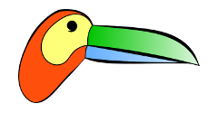

Tucano
======

### Welcome to Tucano, a Library for rapid prototyping with modern OpenGL and GLSL.

Tucano encapsulates many common OpenGL/GLSL features in C++ classes, saving a lot of coding and allowing the developer to concentrate on the core of the application and the Shader codes.

By keeping the code **clean** and **compact**, Tucano also renders the code **less bug prone**.

## Features

* easily create and use Textures, FBOs, Shader Programs, Textures, modern OpenGL buffers...

* common classes used in most applications, such as Mesh, Camera, Trackball, and much more

* automatic texture unit assignment when binding textures, no need to worry about keeping track of ids

* uniforms, textures, and attributes are linked with the shaders in a simple and transparent way (no need to manually set locations)

* wrapper for Eigen Geometry, e.g. directly pass an *Eigen Matrix4f* to a GLSL Shader *mat4*

* use it with Qt, Glut, Glfw, or any other window manager that supports OpenGL

* examples and a collection of common effects (Phong, Image filters, SSAO...)
* some mesh files can be found in http://graphics.stanford.edu/data/3Dscanrep/ like a xyzrgb_statuette.ply.gz

## Download

Download Tucano from GITLAB: https://gitlab.com/lcg/tucano/

## Documentation

Documentation is available at http://www.lcg.ufrj.br/tucano

## Requirements

Tucano has only two library dependencies (make sure you have a recent version of them):

* Eigen : http://eigen.tuxfamily.org/
* GLEW : http://glew.sourceforge.net/
  
> Note that you need an OpenGL driver that supports at least version 4.3.

## Using

No need to compile Tucano, just include *tucano.hpp* in your project and be happy!

* use the `TUCANODEBUG` flag for debugging

## Examples

Tucano comes with several examples and an Effects Collection.

Check out the [Samples](@ref examples) page for the examples and the [Effects](@ref effects) Collection.

## Development Notice

Even though **Tucano** is out, there are still some features that are not implemented, such as some *Buffer Objects* types. Since there are a lot of OpenGL features that could be encapsulated within Tucano, we are including most things on a per-demand basis.

We are translating the Qt examples to GLFW, since the release of Qt5.5 it became surprisingly difficult to use external calls to OpenGL without explicitly inserting Qt code inside Tucano main classes. This also means that the qt helper classes (inside utils) will become deprectated in a near future.

Please help us improve Tucano using GitHub's [Issue Tracker](https://gitlab.com/lcg/tucano/issues).

## Developers

Tucano is maintained by the [Computer Graphics Lab](http://www.lcg.ufrj.br) at [UFRJ](http://www.ufrj.br).

Tucano was initially developed by:

- [Ricardo Marroquim](http://www.lcg.ufrj.br/~marroquim)
- Vitor de Andrade

A list of Tucano's contributors:

- Thiago Perrotta
- Felipe Moura de Carvalho
- [Daniel Pinto Coutinho](http://www.lcg.ufrj.br/dpcoutinho)
- Vinicius da Silva
